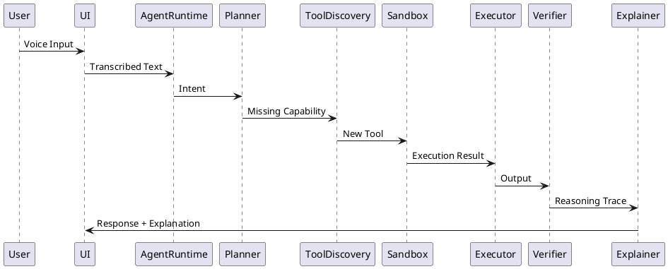
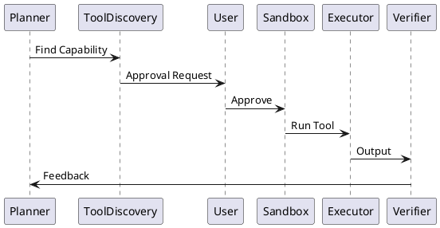

# SPEC-1-Agentic Voice Assistant

## Background

Current voice assistants are largely static: they rely on pre-integrated tools, have limited long-term memory, weak self-correction, and poor transparency in decision-making. They also struggle with multilingual conversations, desktop-level system integration, and privacy-conscious execution.

This specification defines a **desktop-native, cloud-first agentic voice assistant** that can autonomously expand its capabilities, learn from failures, maintain persistent contextual memory, and explain its reasoning. The system is designed to integrate seamlessly with desktop operating systems while enforcing strict security boundaries for autonomous tool execution.

---

## Requirements

### Must Have (M)

* Voice-based interaction with desktop-native UI and system integration
* Cloud-first LLM-driven agentic reasoning
* Autonomous discovery, understanding, and integration of new tools (via APIs)
* Strict sandboxing of all autonomous tools (Docker / WASM)
* Explicit approval-based outbound internet access per tool
* Long-term contextual memory across conversations
* Multilingual input with automatic language detection and code-switching
* Explainable actions and responses ("why" and "how")
* Consistent, verifiable outputs with self-correction mechanisms

### Should Have (S)

* User preference modeling (tone, language, workflows)
* Native OS features (tray, notifications, global shortcuts)
* Failure analysis and capability gap detection
* Encrypted local storage for sensitive data

### Could Have (C)

* WASM-first execution for lightweight tools
* User-visible tool permission dashboard
* Cross-device memory sync (optional cloud backup)

### Won’t Have (W) — MVP

* Fully offline operation
* Embedded / mobile platform support
* On-device large model training

---

## Method

### High-Level Architecture

The system is designed as a **single-user, local-first desktop application** with cloud-dependent reasoning. It follows an **agentic architecture** where specialized agents collaborate to interpret user intent, plan actions, execute tools, verify results, and explain outcomes.

**Core Components**:

* **Desktop Shell (Tauri + Rust)**: Native OS integration, security enforcement, permissions, IPC.
* **UI Layer (React + TypeScript)**: Voice controls, explanations, approvals, system feedback.
* **Agent Runtime (Python)**: Central reasoning and orchestration layer.
* **Cloud LLMs**: Planning, reasoning, multilingual understanding.
* **Tool Sandbox**: Docker/WASM isolated execution.
* **Memory Subsystem**: Persistent contextual memory.

---

### Agent Roles

1. **Intent Interpreter Agent**

   * Parses voice input
   * Detects language(s)
   * Normalizes intent

2. **Planner Agent**

   * Determines if existing tools can satisfy intent
   * Plans multi-step execution
   * Decides when tool discovery is required

3. **Tool Discovery Agent**

   * Searches for relevant APIs
   * Loads and parses OpenAPI documentation
   * Generates tool manifests

4. **Executor Agent**

   * Executes approved tools in sandboxed environments
   * Handles retries and partial failures

5. **Verifier / Critic Agent**

   * Validates outputs
   * Detects inconsistencies or uncertainty
   * Triggers self-correction

6. **Explainer Agent**

   * Produces user-facing explanations
   * Summarizes reasoning and actions

---

### Trust & Security Boundaries

* **User Boundary**: Explicit approval required for:

  * New tool installation
  * Internet access per tool
  * Data persistence beyond session

* **Sandbox Boundary**:

  * Tools run in Docker containers with:

    * No filesystem access
    * No outbound network unless approved
    * Resource limits (CPU, memory)

* **System Boundary**:

  * Rust layer enforces OS-level permissions
  * Python runtime has no direct OS access

---

### Component Interaction (Conceptual)



---

## Data & Memory Design

The assistant operates as a **single-user system with fully local-only long-term memory**. No long-term data is synced or persisted in the cloud. Cloud services are used exclusively for transient LLM inference.

### Memory Types

1. **Short-Term Working Memory**

   * Purpose: Maintain conversational state during an active session
   * Technology: Redis (local)
   * Retention: Minutes to hours
   * Contents:

     * Recent conversation turns
     * Active plans and agent states
     * Temporary tool outputs

2. **Long-Term Semantic Memory**

   * Purpose: Recall past conversations, facts, preferences, and habits
   * Technology: Qdrant (local vector database)
   * Retention: Persistent
   * Contents:

     * Conversation embeddings
     * Learned user preferences
     * Tool usage patterns

3. **User Profile & Preferences (Structured Memory)**

   * Purpose: Deterministic personalization and settings
   * Technology: PostgreSQL (local)

```sql
CREATE TABLE user_profile (
  id INTEGER PRIMARY KEY,
  preferred_languages TEXT[],
  communication_style TEXT,
  privacy_level TEXT,
  created_at TIMESTAMP
);
```

4. **Episodic & Reasoning Logs**

   * Purpose: Explainability, debugging, and self-improvement
   * Technology: Encrypted local SQLite / JSONL
   * Contents:

     * Agent decisions
     * Tool failures
     * Verifier feedback

---

### Memory Access & Governance

* Memory retrieval occurs **before** each LLM call
* Only minimal, relevant summaries are injected into prompts
* Raw memory entries are never sent to the cloud
* All long-term memory is AES-encrypted at rest

---

### User-Controlled Memory Management (Required)

The UI must provide a **Memory Inspector** allowing users to:

* Browse individual memory entries (semantic, episodic, preferences)
* Edit or correct stored facts and preferences
* Delete individual memory items
* Perform full memory reset

All memory changes are immediately reflected in subsequent agent behavior.

---

## Autonomous Tool Lifecycle

### Tool Model

Each tool is treated as an **independent, stateful capability module** with its own isolated storage and permission set.

**Tool Properties**:

* Unique tool ID
* Versioned manifest (derived from OpenAPI or inferred schema)
* Explicit permissions:

  * Internet access (default: denied)
  * Local storage quota
  * Execution limits

---

### Tool State Persistence

* Tools are **allowed to persist internal state across runs**
* State is stored in **tool-scoped volumes** (Docker volumes / WASM storage)
* No tool may access another tool’s state
* Tool state is never shared with the core memory subsystem unless explicitly exposed via tool outputs

---

### Tool Lifecycle Phases

1. **Discovery**

   * Triggered when Planner detects missing capability
   * Tool Discovery Agent searches APIs and parses documentation

2. **Proposal**

   * Tool manifest generated (capabilities, permissions, risks)
   * User approval required before installation

3. **Installation**

   * Tool packaged into Docker image or WASM module
   * Persistent state volume created

4. **Execution**

   * Executor Agent invokes tool inside sandbox
   * Network access enforced per approval

5. **Verification**

   * Verifier Agent validates outputs
   * Detects anomalies or failures

6. **Evolution**

   * Tool may be upgraded or replaced
   * State migration handled explicitly

7. **Revocation**

   * User can disable or remove tool
   * Tool state can be preserved or destroyed

---

### Tool Permission Enforcement

* Docker-level network isolation
* Read/write access only to tool-scoped volume
* CPU and memory limits enforced
* Rust (Tauri) layer acts as final policy gate

---



---

## Implementation Architecture

### Process Model

The assistant runs as a **background-first, tray-based system service** that starts automatically on OS boot.

**Processes**:

* **Tauri Core (Rust)** – system tray, autostart, permissions, policy enforcement
* **UI WebView** – loaded on demand (hotkey, tray click)
* **Python Agent Runtime** – long-running local service
* **Docker Engine** – sandboxed tool execution

---

### Startup & Lifecycle

1. System boots
2. Tauri core starts via OS autostart
3. Python agent runtime is launched in background
4. Tray icon becomes available
5. UI window is instantiated only when needed

If the UI is closed, the assistant **continues running** in the background.

---

### Inter-Process Communication (IPC)

* Tauri ⇄ Python: Localhost HTTP or Unix socket
* Python ⇄ Docker: Docker Engine API
* UI ⇄ Tauri: Secure IPC channels

---

### Failure & Recovery

* Agent crashes trigger automatic restart
* Tool container failures are isolated
* Verifier detects degraded behavior and signals recovery
* User is notified only when intervention is required

---

## Implementation

### Phase 1: Foundation

* Set up monorepo structure:

  * `/desktop` – Tauri (Rust) + React UI
  * `/agent` – Python agent runtime (FastAPI + LangGraph)
  * `/tools` – Tool templates and sandbox definitions
* Configure OS autostart (Windows/macOS/Linux)
* Implement tray-first lifecycle (background service + on-demand UI)
* Establish secure IPC between Tauri and Python (Unix socket / localhost)

---

### Phase 2: Agent Runtime

* Implement core agents:

  * Intent Interpreter
  * Planner
  * Executor
  * Verifier
  * Explainer
* Integrate cloud LLM provider abstraction
* Add structured reasoning with Pydantic schemas
* Implement uncertainty signaling and clarification requests

---

### Phase 3: Memory System

* Deploy local Redis, Qdrant, and PostgreSQL
* Implement memory retrieval pipeline (pre-LLM)
* Build Memory Inspector UI:

  * Browse, edit, delete individual entries
  * Full reset option
* Add encryption-at-rest for all persistent data

---

### Phase 4: Autonomous Tooling

* Implement Tool Discovery Agent
* Build OpenAPI ingestion and tool manifest generator
* Integrate Docker-based sandbox execution
* Enforce permission model (internet, storage, limits)
* Support stateful tool volumes

---

### Phase 5: Voice & Multilingual

* Integrate cloud STT (Whisper-class)
* Integrate cloud TTS
* Add automatic language detection
* Enable code-switching within conversations

---

### Phase 6: Reliability & UX

* Add verifier-driven self-correction loops
* Implement crash recovery and restart logic
* Add native notifications and approval dialogs
* Polish native look & feel per OS

---

## Milestones

### Milestone 1 – MVP (Foundational Assistant)

* Tray-first desktop assistant
* Voice input/output
* Cloud LLM reasoning
* Manual tool approval
* Local memory persistence

### Milestone 2 – Agentic Expansion

* Autonomous tool discovery
* Docker sandbox execution
* Self-correction and verification
* Explainable reasoning UI

### Milestone 3 – Trust & Control

* Memory Inspector
* Tool permission dashboard
* Explicit uncertainty handling

### Milestone 4 – Stability & Polish

* Crash resilience
* Performance tuning
* UX refinement
* Documentation and onboarding

---

## Gathering Results

* Verify requirement coverage against MoSCoW list
* Measure response consistency and correction rates
* Validate tool isolation and permission enforcement
* User trust metrics:

  * Explanation clarity
  * Memory control satisfaction
* Long-term stability monitoring (crash frequency, recovery success)
